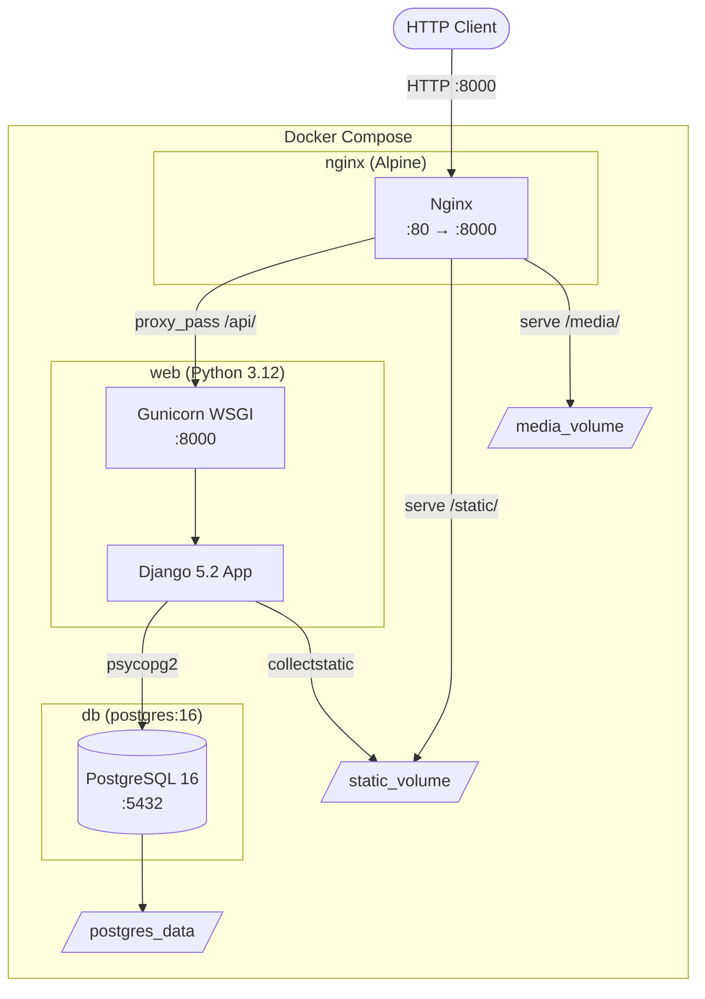
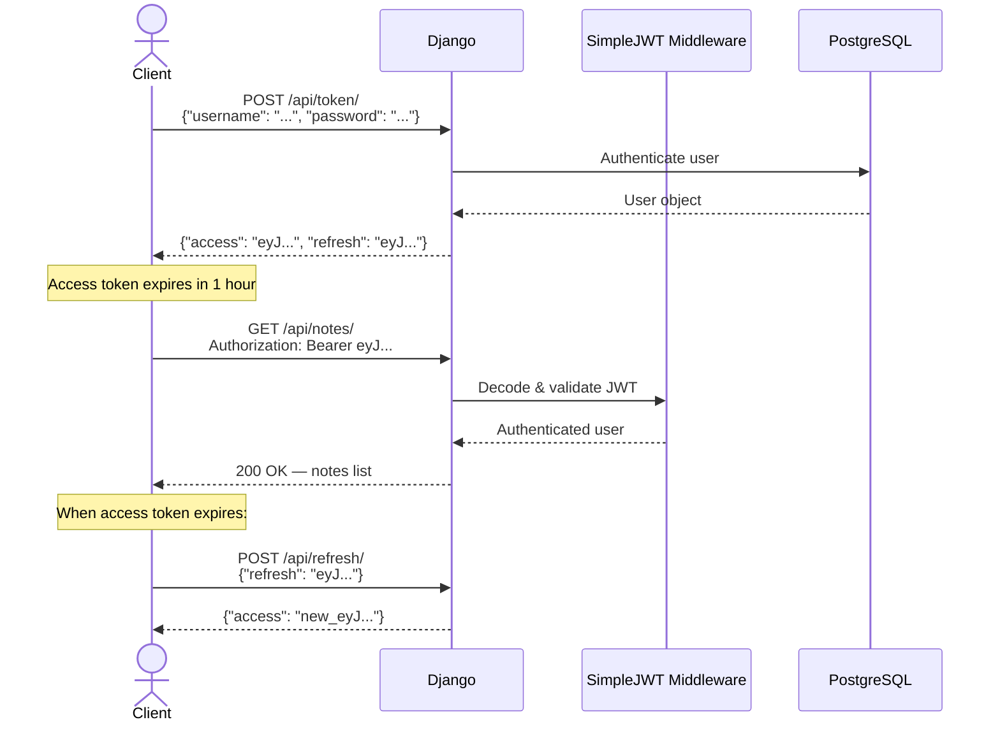
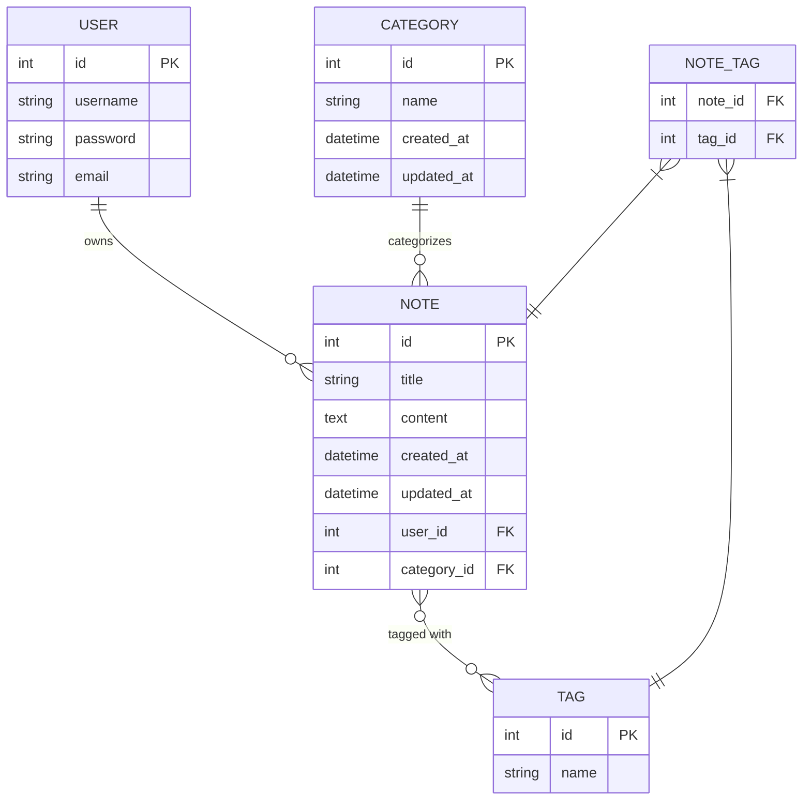

<div align="center">

# Notes App API

### Project 2 of 3 — Docker · PostgreSQL · JWT · Swagger

[](https://www.python.org/)
[](https://www.djangoproject.com/)
[](https://www.django-rest-framework.org/)
[](https://www.postgresql.org/)
[](https://www.docker.com/)
[](https://jwt.io/)

**A fully containerized notes management API with categories, tags, JWT authentication, PostgreSQL, and interactive Swagger documentation — served behind an Nginx reverse proxy.**

</div>

---

## Table of Contents

- [Overview](#overview)
- [Features](#features)
- [Project Architecture](#project-architecture)
- [Folder Structure](#folder-structure)
- [Data Models](#data-models)
- [API Endpoints](#api-endpoints)
- [Authentication](#authentication)
- [Docker Setup](#docker-setup)
- [Local Development](#local-development)
- [Example Requests](#example-requests)
- [Example Responses](#example-responses)
- [Environment Variables](#environment-variables)
- [Future Improvements](#future-improvements)

---

## Overview

The Notes App API is the second project in this series — a significant step up from Project 1. It introduces production-aligned infrastructure: Docker Compose orchestrates a three-service stack (PostgreSQL + Django/Gunicorn + Nginx), JWT replaces token auth, and `drf-spectacular` provides auto-generated OpenAPI documentation accessible via Swagger UI.

The data model introduces **relational complexity**: Notes belong to a Category (ForeignKey) and can have multiple Tags (ManyToManyField), demonstrating realistic database design patterns.

**New concepts introduced in this project:**
- Docker Compose multi-service orchestration
- PostgreSQL database integration with `psycopg2`
- JWT authentication (`djangorestframework-simplejwt`)
- Many-to-many relationships (`ManyToManyField`, `SlugRelatedField`)
- Auto-generated Swagger UI via `drf-spectacular`
- Nginx as a reverse proxy for static and media files
- Health checks and container startup ordering
- Non-root Docker user for security

---

## Features

- Full **CRUD** for **Notes**, **Categories**, and **Tags** (three separate resource endpoints)
- **Many-to-many** Note ↔ Tag relationship — a note can have multiple tags; tags can belong to multiple notes
- **JWT authentication** via `djangorestframework-simplejwt`
  - Access token lifetime: **1 hour**
  - Refresh token lifetime: **7 days**
- **Per-user note isolation** — users only see their own notes
- **Nested read fields** on serializer responses: `category_name`, `tags_names`, `user_name`
- **Interactive Swagger UI** at `/api/docs/` for exploring and testing the API
- **Raw OpenAPI schema** at `/api/schema/` (JSON/YAML)
- **Dockerized** production-style deployment: PostgreSQL 16 + Gunicorn + Nginx (Alpine)
- Nginx serves `/static/` and `/media/` directly from named volumes
- Auto-runs `migrate` and `collectstatic` on container startup
- PostgreSQL **health check** — Django only starts after the database is ready
- Non-root `django-user` in the Docker container

---

## Project Architecture



### Authentication Flow



---

## Folder Structure

```
2. notes_app_api/
├── app/
│   ├── core/
│   │   ├── __init__.py
│   │   ├── settings.py          # PostgreSQL, JWT, drf-spectacular config
│   │   ├── urls.py              # Notes routes + JWT token + Swagger endpoints
│   │   ├── wsgi.py
│   │   └── asgi.py
│   ├── notes/
│   │   ├── __init__.py
│   │   ├── apps.py
│   │   ├── models.py            # Note, Category, Tag models
│   │   ├── serializers.py       # Nested serializers with SlugRelatedField
│   │   ├── views.py             # NotesViewSet, CategoryViewSet, TagsViewSet
│   │   ├── urls.py              # DefaultRouter for notes/categories/tags
│   │   ├── tests.py
│   │   └── migrations/
│   │       ├── __init__.py
│   │       └── 0001_initial.py
│   ├── manage.py
│   └── requirements.txt
├── docker/
│   └── nginx/
│       └── default.conf         # Nginx proxy + static/media location blocks
├── .gitignore
├── Dockerfile                   # Python 3.12 + gunicorn + non-root user
└── docker-compose.yml           # db + web + nginx services + volumes
```

---

## Data Models

### Entity Relationship Diagram



### Category

| Field | Type | Notes |
|-------|------|-------|
| `id` | `AutoField` | Primary key, auto-generated |
| `name` | `CharField(255)` | Category name (required) |
| `created_at` | `DateTimeField` | Auto-set on creation, read-only |
| `updated_at` | `DateTimeField` | Auto-updated on save |

### Tag

| Field | Type | Notes |
|-------|------|-------|
| `id` | `AutoField` | Primary key |
| `name` | `CharField(255)` | Tag label (required) |

### Note

| Field | Type | Notes |
|-------|------|-------|
| `id` | `AutoField` | Primary key |
| `title` | `CharField(255)` | Note title (required) |
| `content` | `TextField` | Note body (optional) |
| `user` | `ForeignKey(User)` | Auto-assigned; `CASCADE` delete |
| `category` | `ForeignKey(Category)` | Required; `CASCADE` delete |
| `tags` | `ManyToManyField(Tag)` | Zero or more tags |
| `created_at` | `DateTimeField` | Auto-set on creation |
| `updated_at` | `DateTimeField` | Auto-updated on save |

---

## API Endpoints

**Base URL:** `http://localhost:8000`
**Swagger UI:** `http://localhost:8000/api/docs/`

### Authentication

| Method | Endpoint | Description |
|--------|----------|-------------|
| `POST` | `/api/token/` | Obtain JWT access + refresh tokens |
| `POST` | `/api/refresh/` | Exchange refresh token for new access token |

### Notes

| Method | Endpoint | Description | Auth |
|--------|----------|-------------|:----:|
| `GET` | `/api/notes/` | List notes (current user only) | JWT |
| `POST` | `/api/notes/` | Create a new note | JWT |
| `GET` | `/api/notes/{id}/` | Retrieve a note | JWT |
| `PUT` | `/api/notes/{id}/` | Full update of a note | JWT |
| `PATCH` | `/api/notes/{id}/` | Partial update of a note | JWT |
| `DELETE` | `/api/notes/{id}/` | Delete a note | JWT |

### Categories

| Method | Endpoint | Description | Auth |
|--------|----------|-------------|:----:|
| `GET` | `/api/categories/` | List all categories | JWT |
| `POST` | `/api/categories/` | Create a category | JWT |
| `GET` | `/api/categories/{id}/` | Retrieve a category | JWT |
| `PUT` | `/api/categories/{id}/` | Update a category | JWT |
| `PATCH` | `/api/categories/{id}/` | Partially update a category | JWT |
| `DELETE` | `/api/categories/{id}/` | Delete a category | JWT |

### Tags

| Method | Endpoint | Description | Auth |
|--------|----------|-------------|:----:|
| `GET` | `/api/tags/` | List all tags | JWT |
| `POST` | `/api/tags/` | Create a tag | JWT |
| `GET` | `/api/tags/{id}/` | Retrieve a tag | JWT |
| `PUT` | `/api/tags/{id}/` | Update a tag | JWT |
| `PATCH` | `/api/tags/{id}/` | Partially update a tag | JWT |
| `DELETE` | `/api/tags/{id}/` | Delete a tag | JWT |

### Documentation

| Endpoint | Description |
|----------|-------------|
| `GET /api/docs/` | Interactive Swagger UI |
| `GET /api/schema/` | Raw OpenAPI 3.0 schema (JSON/YAML) |

---

## Authentication

This project uses **JWT (JSON Web Token)** authentication via `djangorestframework-simplejwt`.

### Token Configuration

| Setting | Value |
|---------|-------|
| Access token lifetime | 1 hour |
| Refresh token lifetime | 7 days |
| Algorithm | HS256 |

### Workflow

```
1. POST /api/token/ → get access + refresh tokens
2. Add "Authorization: Bearer <access_token>" to all requests
3. When access token expires → POST /api/refresh/ to get a new one
4. When refresh token expires → re-authenticate with credentials
```

---

## Docker Setup

### Prerequisites
- Docker 20.10+
- Docker Compose 2.0+

### Start the full stack

```bash
cd "2. notes_app_api"

# Build images and start all services in the foreground
docker-compose up --build
```

On first startup, the `web` container automatically runs:
1. `python manage.py migrate` — creates all database tables
2. `python manage.py collectstatic --noinput` — gathers static files
3. `gunicorn core.wsgi:application --bind 0.0.0.0:8000` — starts the app server

### Create a superuser

```bash
# In a separate terminal
docker-compose exec web python manage.py createsuperuser
```

### Common Commands

```bash
# Start in detached (background) mode
docker-compose up -d --build

# View logs
docker-compose logs -f web

# Run migrations manually
docker-compose exec web python manage.py migrate

# Open a Django shell
docker-compose exec web python manage.py shell

# Stop services
docker-compose down

# Stop and wipe all data (including database)
docker-compose down -v
```

### Services Overview

| Service | Image | Port | Purpose |
|---------|-------|------|---------|
| `db` | `postgres:16` | `5432` (internal) | PostgreSQL database |
| `web` | Built from `Dockerfile` | `8000` (internal) | Django + Gunicorn app |
| `nginx` | `nginx:alpine` | `8000 → 80` | Reverse proxy + static files |

---

## Local Development

Running without Docker requires a local PostgreSQL instance.

```bash
# 1. Navigate to the app directory
cd "2. notes_app_api/app"

# 2. Create and activate a virtual environment
python -m venv venv
source venv/bin/activate    # Windows: venv\Scripts\activate

# 3. Install dependencies
pip install -r requirements.txt

# 4. Set up environment variables
# Create a .env file in "2. notes_app_api/app/" with your local DB credentials:
# POSTGRES_DB=notes_db
# POSTGRES_USER=your_db_user
# POSTGRES_PASSWORD=your_db_password

# 5. Update settings.py DATABASE HOST to "localhost" (instead of "db")

# 6. Apply migrations
python manage.py migrate

# 7. Create a superuser
python manage.py createsuperuser

# 8. Run the development server
python manage.py runserver
```

---

## Example Requests

### Obtain JWT Tokens

```bash
curl -X POST http://localhost:8000/api/token/ \
  -H "Content-Type: application/json" \
  -d '{"username": "admin", "password": "adminpassword"}'
```

### Create a Category

```bash
curl -X POST http://localhost:8000/api/categories/ \
  -H "Authorization: Bearer <access-token>" \
  -H "Content-Type: application/json" \
  -d '{"name": "Work"}'
```

### Create a Tag

```bash
curl -X POST http://localhost:8000/api/tags/ \
  -H "Authorization: Bearer <access-token>" \
  -H "Content-Type: application/json" \
  -d '{"name": "urgent"}'
```

### Create a Note with Tags

```bash
curl -X POST http://localhost:8000/api/notes/ \
  -H "Authorization: Bearer <access-token>" \
  -H "Content-Type: application/json" \
  -d '{
    "title": "Sprint planning notes",
    "content": "Review backlog, estimate stories, set sprint goal.",
    "category": 1,
    "tags": [1, 2]
  }'
```

### List Notes

```bash
curl http://localhost:8000/api/notes/ \
  -H "Authorization: Bearer <access-token>"
```

### Update a Note (Partial)

```bash
curl -X PATCH http://localhost:8000/api/notes/1/ \
  -H "Authorization: Bearer <access-token>" \
  -H "Content-Type: application/json" \
  -d '{"content": "Updated meeting notes content."}'
```

### Refresh Access Token

```bash
curl -X POST http://localhost:8000/api/refresh/ \
  -H "Content-Type: application/json" \
  -d '{"refresh": "<refresh-token>"}'
```

---

## Example Responses

### `POST /api/token/` — 200 OK

```json
{
  "access": "eyJhbGciOiJIUzI1NiIsInR5cCI6IkpXVCJ9.eyJ0b2tlbl90eXBlIjoiYWNjZXNzIiwiZXhwIjoxNzM3MDAwMDAwLCJ1c2VyX2lkIjoxfQ.abc123",
  "refresh": "eyJhbGciOiJIUzI1NiIsInR5cCI6IkpXVCJ9.eyJ0b2tlbl90eXBlIjoicmVmcmVzaCIsImV4cCI6MTczNzYwMDAwMCwidXNlcl9pZCI6MX0.xyz789"
}
```

### `GET /api/notes/` — 200 OK

```json
[
  {
    "id": 1,
    "title": "Sprint planning notes",
    "content": "Review backlog, estimate stories, set sprint goal.",
    "category": 1,
    "category_name": "Work",
    "tags": [1, 2],
    "tags_names": ["urgent", "q1"],
    "created_at": "2024-01-15T09:00:00.000000Z",
    "user": 1,
    "user_name": "admin"
  }
]
```

### `POST /api/notes/` — 201 Created

```json
{
  "id": 2,
  "title": "Book recommendations",
  "content": "Clean Code, The Pragmatic Programmer, DDIA",
  "category": 2,
  "category_name": "Personal",
  "tags": [],
  "tags_names": [],
  "created_at": "2024-01-16T14:30:00.000000Z",
  "user": 1,
  "user_name": "admin"
}
```

### `POST /api/notes/` — 400 Bad Request (missing category)

```json
{
  "category": [
    "This field is required."
  ]
}
```

### `GET /api/notes/` — 401 Unauthorized

```json
{
  "detail": "Authentication credentials were not provided."
}
```

---

## Environment Variables

Create a `.env` file in the `2. notes_app_api/` directory:

```env
POSTGRES_DB=notes_db
POSTGRES_USER=notes_user
POSTGRES_PASSWORD=a-strong-password
```

| Variable | Description | Example |
|----------|-------------|---------|
| `POSTGRES_DB` | PostgreSQL database name | `notes_db` |
| `POSTGRES_USER` | PostgreSQL username | `notes_user` |
| `POSTGRES_PASSWORD` | PostgreSQL password | `securepassword` |

> The `SECRET_KEY` and `DEBUG` settings are currently hardcoded in `settings.py`. For production, move them to `.env` as well.

---

## Future Improvements

- [ ] Add user registration endpoint (`/api/register/`)
- [ ] Add search and filtering for notes (by title, category, tag)
- [ ] Add pagination (`PageNumberPagination`) to list endpoints
- [ ] Add ordering to notes list (by `created_at`, `updated_at`, `title`)
- [ ] Write integration tests using DRF's `APITestCase`
- [ ] Add GitHub Actions CI to run tests on push
- [ ] Move `SECRET_KEY` and `DEBUG` to environment variables
- [ ] Add note soft-delete / archive functionality
- [ ] Add ordering control on `Category` and `Tag` viewsets (restrict to current user)

---

<div align="center">

Part of the **[Django Advanced REST API Course](../README.md)** repository

</div>
