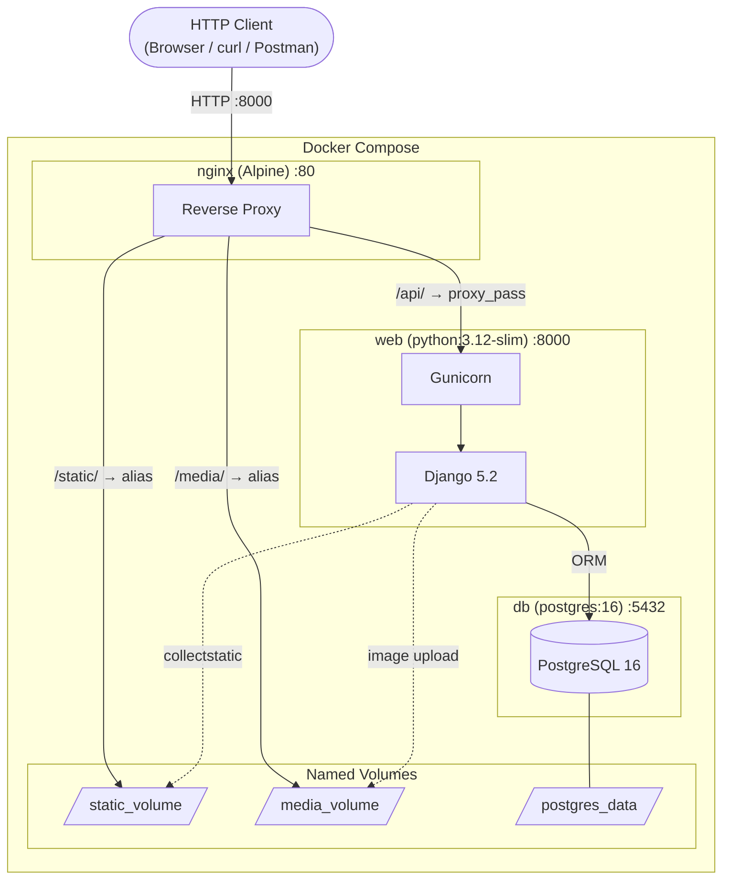
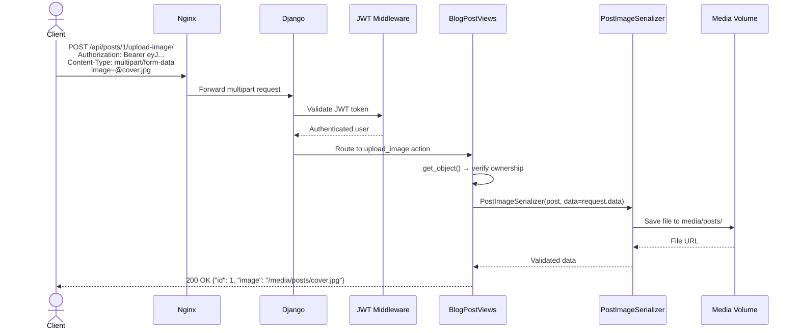
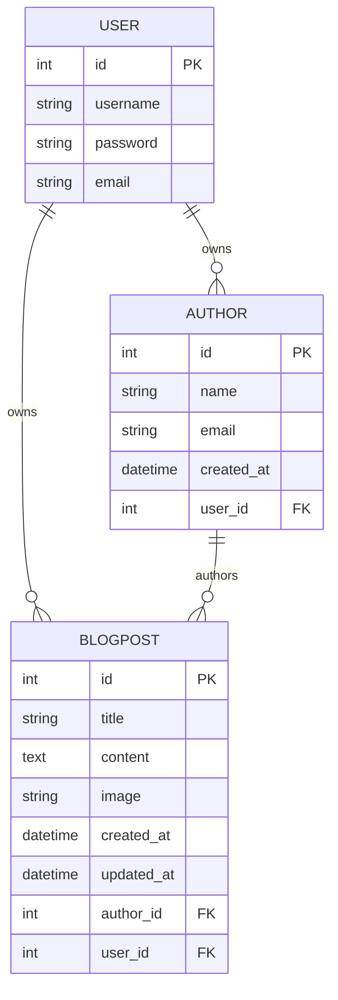

<div align="center">

# Blog App API

### Project 3 of 3 — Full-Featured Blog Platform with Image Uploads

[](https://www.python.org/)
[](https://www.djangoproject.com/)
[](https://www.django-rest-framework.org/)
[](https://www.postgresql.org/)
[](https://www.docker.com/)
[](https://jwt.io/)
[](https://swagger.io/)

**The most feature-complete project in this series — a full blog platform API with author profiles, blog posts, cover image uploads, custom object-level permissions, and a production-ready Docker stack.**

</div>

---

## Table of Contents

- [Overview](#overview)
- [Features](#features)
- [Project Architecture](#project-architecture)
- [Folder Structure](#folder-structure)
- [Data Models](#data-models)
- [API Endpoints](#api-endpoints)
- [Authentication](#authentication)
- [Image Upload](#image-upload)
- [Permissions](#permissions)
- [Docker Setup](#docker-setup)
- [Local Development](#local-development)
- [Example Requests](#example-requests)
- [Example Responses](#example-responses)
- [Environment Variables](#environment-variables)
- [Future Improvements](#future-improvements)

---

## Overview

The Blog App API is the most complete project in this series. It builds a realistic blog platform backend with two related resources — **Authors** and **Blog Posts** — with full CRUD, JWT authentication, custom object-level permissions, and a dedicated image upload endpoint.

Beyond what was introduced in Project 2, this project adds:
- **Image upload** to a custom endpoint using `MultiPartParser` and `FormParser`
- **`ImageField`** on a model with Pillow image processing
- **Custom permission class** (`IsOwner`) for object-level authorization
- **WhiteNoise** for efficient static file serving
- **Production-tuned Docker setup** with `python:3.12-slim` for smaller image size
- **`DEBUG` toggled via environment variable** for proper prod/dev switching

---

## Features

- Full **CRUD** for **Authors** and **Blog Posts**
- **Image upload** for post cover photos via a dedicated `POST /api/posts/{id}/upload-image/` action
  - Accepts `multipart/form-data` — powered by `MultiPartParser` + `FormParser`
  - Images stored under `media/posts/` directory
  - Served via Nginx at `/media/` URL path
- **Custom `IsOwner` permission** — object-level check ensures only the owner can modify their resource
- **Per-user data scoping** on both authors and posts via `get_queryset()` overrides
- **Auto-user assignment** in `perform_create()` — the `user` field is set server-side
- **JWT authentication** (SimpleJWT) — access: 1h, refresh: 7d
- **Interactive Swagger UI** at `/api/docs/` via `drf-spectacular`
- **Dockerized** production stack: PostgreSQL 16 + Gunicorn + Nginx
- **WhiteNoise** for static file serving
- **`.env`-based configuration** with `python-dotenv`
- PostgreSQL **health check** — Django starts only when database is ready
- **`python:3.12-slim`** base image — smaller, faster builds vs full Python image

---

## Project Architecture



### API Request Flow — Image Upload



---

## Folder Structure

```
3. blog_app_api/
├── app/
│   ├── core/
│   │   ├── __init__.py
│   │   ├── settings.py          # PostgreSQL, JWT, Pillow, WhiteNoise, drf-spectacular
│   │   ├── urls.py              # JWT + Swagger + author + posts routes
│   │   ├── wsgi.py
│   │   └── asgi.py
│   ├── author/
│   │   ├── __init__.py
│   │   ├── apps.py
│   │   ├── models.py            # AuthorModel + BlogPostModel (ImageField)
│   │   ├── serializers.py       # AuthorSerializer, BlogPostSerializer, PostImageSerializer
│   │   ├── views.py             # AuthorViews, BlogPostViews + IsOwner permission
│   │   ├── urls.py              # DefaultRouter for /author/ and /posts/
│   │   ├── tests.py
│   │   └── migrations/
│   │       ├── __init__.py
│   │       ├── 0001_initial.py
│   │       ├── 0002_blogpostmodel_user.py
│   │       └── 0003_alter_blogpostmodel_user.py
│   ├── manage.py
│   └── requirements.txt
├── docker/
│   └── nginx/
│       └── default.conf         # Nginx: proxy_pass + /static/ + /media/ locations
├── .env                         # Environment variables (not committed in production)
├── .gitignore
├── Dockerfile                   # python:3.12-slim + gunicorn + non-root user
└── docker-compose.yml           # db + web + nginx with health checks + volumes
```

---

## Data Models

### Entity Relationship Diagram



### AuthorModel

| Field | Type | Constraints | Notes |
|-------|------|-------------|-------|
| `id` | `AutoField` | Primary Key | Auto-generated, read-only |
| `name` | `CharField(255)` | Required | Author display name |
| `email` | `EmailField(255)` | Required | Validated email format |
| `created_at` | `DateTimeField` | `auto_now_add=True` | Set on creation |
| `user` | `ForeignKey(User)` | `CASCADE` | Auto-assigned on create |

### BlogPostModel

| Field | Type | Constraints | Notes |
|-------|------|-------------|-------|
| `id` | `AutoField` | Primary Key | Auto-generated |
| `title` | `CharField(255)` | Required | Post headline |
| `content` | `TextField(255)` | Required | Post body content |
| `author` | `ForeignKey(AuthorModel)` | `CASCADE`, Required | Linked author profile |
| `image` | `ImageField` | Optional, `null=True` | Stored at `media/posts/` |
| `created_at` | `DateTimeField` | `auto_now_add=True` | Set on creation |
| `updated_at` | `DateTimeField` | `auto_now=True` | Updated on every save |
| `user` | `ForeignKey(User)` | `CASCADE`, `related_name="posts"` | Auto-assigned |

---

## API Endpoints

**Base URL:** `http://localhost:8000`
**Swagger UI:** `http://localhost:8000/api/docs/`

### Authentication

| Method | Endpoint | Description |
|--------|----------|-------------|
| `POST` | `/api/token/` | Obtain JWT access + refresh tokens |
| `POST` | `/api/token/refresh/` | Refresh an expired access token |

### Authors

| Method | Endpoint | Description | Auth |
|--------|----------|-------------|:----:|
| `GET` | `/api/author/` | List your author profiles | JWT |
| `POST` | `/api/author/` | Create an author profile | JWT |
| `GET` | `/api/author/{id}/` | Retrieve an author | JWT |
| `PUT` | `/api/author/{id}/` | Full update | JWT |
| `PATCH` | `/api/author/{id}/` | Partial update | JWT |
| `DELETE` | `/api/author/{id}/` | Delete an author | JWT |

### Blog Posts

| Method | Endpoint | Description | Auth |
|--------|----------|-------------|:----:|
| `GET` | `/api/posts/` | List your blog posts | JWT |
| `POST` | `/api/posts/` | Create a blog post | JWT |
| `GET` | `/api/posts/{id}/` | Retrieve a post | JWT |
| `PUT` | `/api/posts/{id}/` | Full update | JWT |
| `PATCH` | `/api/posts/{id}/` | Partial update | JWT |
| `DELETE` | `/api/posts/{id}/` | Delete a post | JWT |
| `POST` | `/api/posts/{id}/upload-image/` | Upload a cover image | JWT |

### Documentation

| Endpoint | Description |
|----------|-------------|
| `GET /api/docs/` | Interactive Swagger UI |
| `GET /api/schema/` | Raw OpenAPI 3.0 schema |

---

## Authentication

JWT authentication via `djangorestframework-simplejwt`.

| Token Type | Lifetime |
|-----------|---------|
| Access Token | Configurable (default: short-lived) |
| Refresh Token | Configurable (default: 7 days) |

**Step 1: Obtain tokens**

```bash
curl -X POST http://localhost:8000/api/token/ \
  -H "Content-Type: application/json" \
  -d '{"username": "admin", "password": "yourpassword"}'
```

**Step 2: Authenticate requests**

```
Authorization: Bearer <access-token>
```

**Step 3: Refresh when expired**

```bash
curl -X POST http://localhost:8000/api/token/refresh/ \
  -H "Content-Type: application/json" \
  -d '{"refresh": "<refresh-token>"}'
```

---

## Image Upload

Blog posts support an optional cover image uploaded via a dedicated action endpoint.

### Endpoint

```
POST /api/posts/{id}/upload-image/
Content-Type: multipart/form-data
Authorization: Bearer <access-token>
```

### How It Works

The `upload_image` method is a custom `@action` on `BlogPostViews`:

1. Uses `MultiPartParser` and `FormParser` to handle file data
2. `get_serializer_class()` returns `PostImageSerializer` when the action is `upload_image`
3. `PostImageSerializer` only exposes `id` and `image` fields
4. Uploaded files are stored at `media/posts/<filename>`
5. Nginx serves uploaded images from the `/media/` URL path

### Example

```bash
curl -X POST http://localhost:8000/api/posts/1/upload-image/ \
  -H "Authorization: Bearer <access-token>" \
  -F "image=@/path/to/cover.jpg"
```

**Response:**
```json
{
  "id": 1,
  "image": "/media/posts/cover.jpg"
}
```

---

## Permissions

### `IsAuthenticated` (Global)

All endpoints require a valid JWT token. Unauthenticated requests receive `401 Unauthorized`.

### `IsOwner` (Object-Level)

A custom permission class that checks whether the requesting user owns the object:

```python
class IsOwner(BasePermission):
    def has_object_permission(self, request, view, obj):
        return obj.user == request.user
```

This prevents users from reading, updating, or deleting resources that belong to other users. Unauthorized attempts receive `403 Forbidden`.

### Per-User Query Scoping

Both `AuthorViews` and `BlogPostViews` override `get_queryset()`:

```python
def get_queryset(self):
    return BlogPostModel.objects.filter(user=self.request.user)
```

This ensures users never even see data that doesn't belong to them at the list level.

---

## Docker Setup

### Prerequisites

- Docker 20.10+
- Docker Compose 2.0+

### Configuration

The project uses a `.env` file. The default values are already set but **update them before a real deployment**:

```bash
cat .env
```

```env
DEBUG=0
SECRET_KEY=superkey

POSTGRES_DB=blog_db
POSTGRES_USER=blog_user
POSTGRES_PASSWORD=blog_password

DB_HOST=db
DB_PORT=5432
```

### Start the Stack

```bash
cd "3. blog_app_api"

# Build and start (foreground)
docker-compose up --build

# Build and start (background)
docker-compose up --build -d
```

On first start, the `web` container automatically runs:
1. `python manage.py migrate`
2. `python manage.py collectstatic --noinput`
3. Starts `gunicorn`

### Create a Superuser

```bash
docker-compose exec web python manage.py createsuperuser
```

### Useful Commands

```bash
# View all running services
docker-compose ps

# Follow Django logs
docker-compose logs -f web

# Follow all service logs
docker-compose logs -f

# Open a Django shell
docker-compose exec web python manage.py shell

# Stop services
docker-compose down

# Full reset (removes volumes and database data)
docker-compose down -v
```

### Service Overview

| Service | Image | Port | Role |
|---------|-------|------|------|
| `db` | `postgres:16` | `5432` (internal) | PostgreSQL database with health check |
| `web` | `python:3.12-slim` (custom) | `8000` (internal) | Django + Gunicorn application |
| `nginx` | `nginx:alpine` | `8000 → 80` | Reverse proxy, static & media serving |

---

## Local Development

For local development without Docker, you need a local PostgreSQL instance.

```bash
# 1. Navigate to the app directory
cd "3. blog_app_api/app"

# 2. Create and activate virtual environment
python -m venv venv
source venv/bin/activate    # Windows: venv\Scripts\activate

# 3. Install all dependencies
pip install -r requirements.txt

# 4. Configure local .env
# Edit "3. blog_app_api/.env" — change DB_HOST from "db" to "localhost"

# 5. Apply migrations
python manage.py migrate

# 6. Create superuser
python manage.py createsuperuser

# 7. Start dev server
python manage.py runserver
```

---

## Example Requests

### Obtain JWT Tokens

```bash
curl -X POST http://localhost:8000/api/token/ \
  -H "Content-Type: application/json" \
  -d '{"username": "admin", "password": "adminpassword"}'
```

### Create an Author Profile

```bash
curl -X POST http://localhost:8000/api/author/ \
  -H "Authorization: Bearer <access-token>" \
  -H "Content-Type: application/json" \
  -d '{"name": "Jane Doe", "email": "jane@example.com"}'
```

### Create a Blog Post

```bash
curl -X POST http://localhost:8000/api/posts/ \
  -H "Authorization: Bearer <access-token>" \
  -H "Content-Type: application/json" \
  -d '{
    "title": "Getting Started with Django REST Framework",
    "content": "DRF is a powerful toolkit for building Web APIs...",
    "author": 1
  }'
```

### Upload a Cover Image

```bash
curl -X POST http://localhost:8000/api/posts/1/upload-image/ \
  -H "Authorization: Bearer <access-token>" \
  -F "image=@/path/to/cover.jpg"
```

### List Blog Posts

```bash
curl http://localhost:8000/api/posts/ \
  -H "Authorization: Bearer <access-token>"
```

### Update a Post (Partial)

```bash
curl -X PATCH http://localhost:8000/api/posts/1/ \
  -H "Authorization: Bearer <access-token>" \
  -H "Content-Type: application/json" \
  -d '{"title": "Updated: Getting Started with DRF"}'
```

### Delete a Post

```bash
curl -X DELETE http://localhost:8000/api/posts/1/ \
  -H "Authorization: Bearer <access-token>"
```

---

## Example Responses

### `POST /api/token/` — 200 OK

```json
{
  "access": "eyJhbGciOiJIUzI1NiIsInR5cCI6IkpXVCJ9.eyJ0b2tlbl90eXBlIjoiYWNjZXNzIiwiZXhwIjoxNjk5MDAwMDAwLCJ1c2VyX2lkIjoxfQ.abc",
  "refresh": "eyJhbGciOiJIUzI1NiIsInR5cCI6IkpXVCJ9.eyJ0b2tlbl90eXBlIjoicmVmcmVzaCIsImV4cCI6MTY5OTYwMDAwMCwidXNlcl9pZCI6MX0.xyz"
}
```

### `POST /api/author/` — 201 Created

```json
{
  "id": 1,
  "name": "Jane Doe",
  "email": "jane@example.com",
  "created_at": "2024-01-15T09:00:00.000000Z",
  "user": 1,
  "user_name": "admin"
}
```

### `POST /api/posts/` — 201 Created

```json
{
  "id": 1,
  "title": "Getting Started with Django REST Framework",
  "content": "DRF is a powerful toolkit for building Web APIs...",
  "author": 1,
  "author_name": "Jane Doe",
  "image": null,
  "created_at": "2024-01-15T10:00:00.000000Z",
  "updated_at": "2024-01-15T10:00:00.000000Z",
  "user": 1
}
```

### `GET /api/posts/` — 200 OK

```json
[
  {
    "id": 1,
    "title": "Getting Started with Django REST Framework",
    "content": "DRF is a powerful toolkit for building Web APIs...",
    "author": 1,
    "author_name": "Jane Doe",
    "image": "/media/posts/cover_abc123.jpg",
    "created_at": "2024-01-15T10:00:00.000000Z",
    "updated_at": "2024-01-16T08:30:00.000000Z",
    "user": 1
  }
]
```

### `POST /api/posts/1/upload-image/` — 200 OK

```json
{
  "id": 1,
  "image": "/media/posts/cover_abc123.jpg"
}
```

### `GET /api/posts/2/` — 403 Forbidden (not the owner)

```json
{
  "detail": "You do not have permission to perform this action."
}
```

### `POST /api/posts/` — 401 Unauthorized (no token)

```json
{
  "detail": "Authentication credentials were not provided."
}
```

---

## Environment Variables

Stored in `3. blog_app_api/.env`:

```env
DEBUG=0
SECRET_KEY=your-very-long-and-random-secret-key-here

POSTGRES_DB=blog_db
POSTGRES_USER=blog_user
POSTGRES_PASSWORD=a-strong-password-here

DB_HOST=db
DB_PORT=5432
```

| Variable | Description | Production Value |
|----------|-------------|-----------------|
| `DEBUG` | Enable/disable debug mode. `0` = production | `0` |
| `SECRET_KEY` | Django cryptographic secret. Must be long and random | 50+ random chars |
| `POSTGRES_DB` | Database name | `blog_db` |
| `POSTGRES_USER` | Database username | Custom |
| `POSTGRES_PASSWORD` | Database password | Strong password |
| `DB_HOST` | Database host. Docker service name or IP | `db` |
| `DB_PORT` | PostgreSQL port | `5432` |

> **Important:** Never commit `.env` files with real credentials. The `.gitignore` excludes `.env` from version control.

---

## Future Improvements

- [ ] Add user registration endpoint (`/api/register/`)
- [ ] Implement JWT token blacklisting on logout
- [ ] Add search and filtering for blog posts (by title, author, date range)
- [ ] Add pagination to the posts list endpoint
- [ ] Write 10+ integration tests using DRF's `APITestCase`
- [ ] Add GitHub Actions CI/CD pipeline to run tests and lint on every PR
- [ ] Add post categories or tags (similar to Notes app)
- [ ] Add comment support (`CommentModel` linked to `BlogPostModel`)
- [ ] Add a public/draft status field to posts
- [ ] Implement rate limiting on authentication endpoints
- [ ] Deploy to a cloud provider (Railway / Render / AWS ECS)
- [ ] Add HTTPS via Let's Encrypt + Certbot in Nginx

---

<div align="center">

Part of the **[Django Advanced REST API Course](../README.md)** repository

</div>
