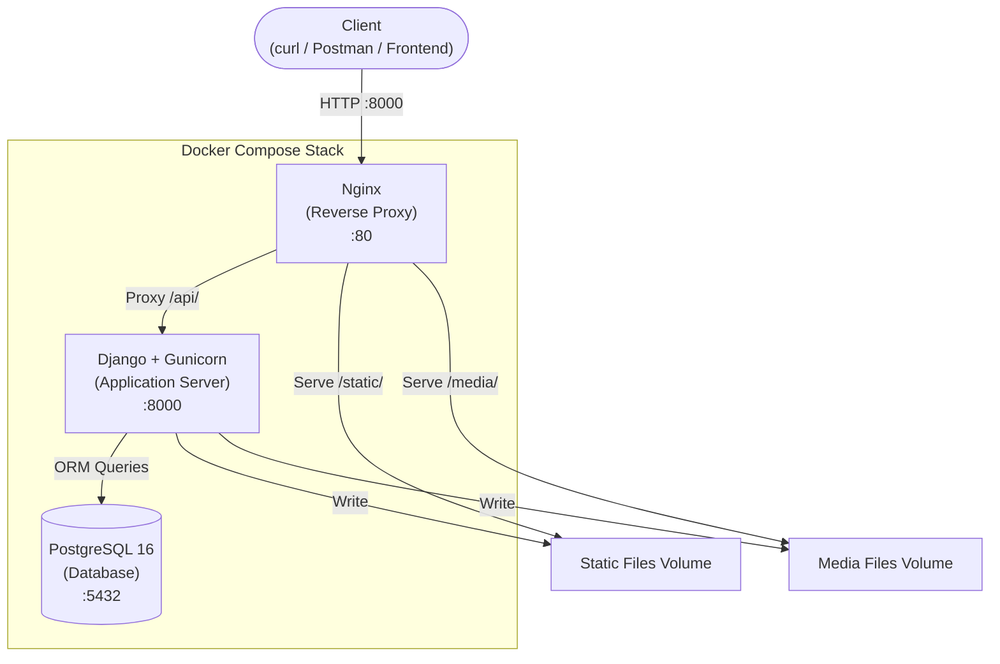
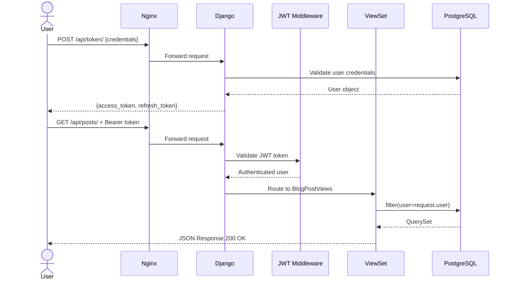
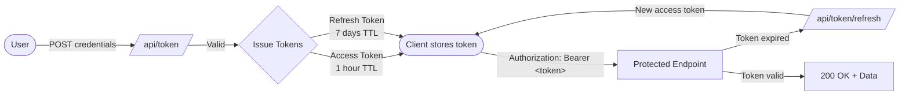
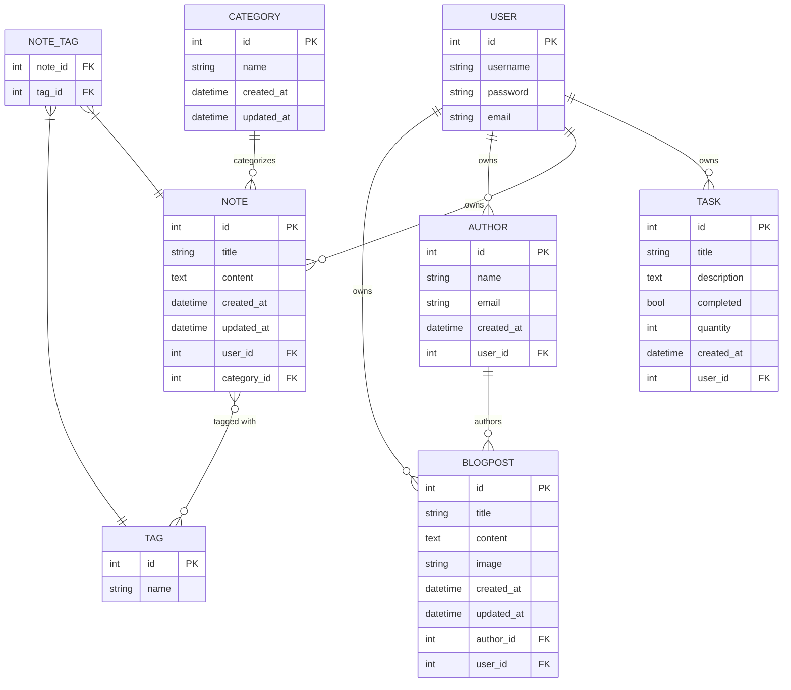

<div align="center">

# Django Advanced REST API Course

### A progressive, hands-on backend engineering portfolio built with Django REST Framework

[](https://www.python.org/)
[](https://www.djangoproject.com/)
[](https://www.django-rest-framework.org/)
[](https://www.postgresql.org/)
[](https://www.docker.com/)
[](./LICENSE)
[](https://github.com/sadykovIsmail/django_advanced_rest_api_course/issues)

**Three progressively complex REST APIs — from a simple SQLite-backed task manager to a fully containerized blog platform with JWT authentication, image uploads, and interactive Swagger documentation.**

</div>

---

## Table of Contents

- [Projects Overview](#projects-overview)
- [Architecture Overview](#architecture-overview)
- [Tech Stack](#tech-stack)
- [Features](#features)
- [Project Structure](#project-structure)
- [Setup & Installation](#setup--installation)
  - [Prerequisites](#prerequisites)
  - [Project 1 — Local Development](#project-1--local-development-no-docker)
  - [Projects 2 & 3 — Docker](#projects-2--3--docker)
- [API Documentation](#api-documentation)
  - [Authentication](#authentication)
  - [Todo API Endpoints](#todo-api-endpoints)
  - [Notes API Endpoints](#notes-api-endpoints)
  - [Blog API Endpoints](#blog-api-endpoints)
- [Database Design](#database-design)
- [Deployment Notes](#deployment-notes)
- [Environment Variables](#environment-variables)
- [Roadmap & Future Improvements](#roadmap--future-improvements)
- [Learning Outcomes](#learning-outcomes)
- [License](#license)

---

## Projects Overview

| # | Project | Stack | Auth | Containerized | Image Upload | API Docs |
|---|---------|-------|------|:---:|:---:|:---:|
| 1 | **[Todo App API](./1.%20todo_app_api/)** | Django 3.2 · SQLite | Token Auth | ✗ | ✗ | ✗ |
| 2 | **[Notes App API](./2.%20notes_app_api/)** | Django 5.2 · PostgreSQL · Nginx | JWT (SimpleJWT) | ✓ | ✗ | Swagger UI |
| 3 | **[Blog App API](./3.%20blog_app_api/)** | Django 5.2 · PostgreSQL · Nginx | JWT (SimpleJWT) | ✓ | ✓ | Swagger UI |

Each project intentionally builds on the previous one, introducing new concepts in a structured progression from foundations to production patterns.

---

## Architecture Overview

### System Architecture (Project 3 — Most Complete)



### API Request Flow



### Authentication Flow



---

## Tech Stack

| Category | Technology | Used In |
|----------|-----------|---------|
| **Language** | Python 3.10 – 3.12 | All projects |
| **Web Framework** | Django 3.2 / 5.2 | All projects |
| **REST Framework** | Django REST Framework 3.16 | All projects |
| **Authentication** | DRF Token Auth | Project 1 |
| **Authentication** | SimpleJWT 5.5 | Projects 2 & 3 |
| **Database** | SQLite | Project 1 |
| **Database** | PostgreSQL 16 | Projects 2 & 3 |
| **Containerization** | Docker + Docker Compose | Projects 2 & 3 |
| **Web Server** | Gunicorn | Projects 2 & 3 |
| **Reverse Proxy** | Nginx (Alpine) | Projects 2 & 3 |
| **Image Processing** | Pillow 10.4 | Project 3 |
| **Static Files** | WhiteNoise 6.7 | Project 3 |
| **API Docs** | drf-spectacular (OpenAPI 3 / Swagger) | Projects 2 & 3 |
| **Config Management** | python-dotenv | Projects 2 & 3 |

---

## Features

### Project 1 — Todo App API
- Full CRUD task management via `ModelViewSet`
- Token-based authentication (`rest_framework.authtoken`)
- Per-user task isolation — users only see their own tasks
- Input validation: `quantity` field constrained to values 1–5 using Django validators
- Read-only field enforcement on `id`, `created_at`, `completed`, and `user`

### Project 2 — Notes App API
- Full CRUD for **Notes**, **Categories**, and **Tags**
- Many-to-many relationship: a Note can have multiple Tags
- JWT authentication with configurable token lifetime (access: 1h, refresh: 7d)
- Dockerized three-service stack: PostgreSQL + Gunicorn + Nginx
- Nginx reverse proxy with separate `/static/` and `/media/` routing
- Auto-migration and `collectstatic` on container startup
- Interactive Swagger UI via `drf-spectacular`

### Project 3 — Blog App API
- Full CRUD for **Authors** and **Blog Posts**
- **Image upload** for post cover photos via a dedicated `POST /api/posts/{id}/upload-image/` action
- `MultiPartParser` + `FormParser` for multipart form data handling
- Custom `IsOwner` object-level permission class
- Per-user data scoping for both authors and posts
- WhiteNoise for static file serving
- `.env`-based configuration management
- Production-ready Docker Compose setup with health checks

---

## Project Structure

```
django_advanced_rest_api_course/
│
├── 1. todo_app_api/                    # Project 1: Foundations
│   ├── core/
│   │   ├── settings.py                 # SQLite + Token Auth config
│   │   ├── urls.py                     # Root URL config
│   │   ├── wsgi.py
│   │   └── asgi.py
│   ├── tasks/
│   │   ├── models.py                   # Task model (title, quantity, user FK)
│   │   ├── serializers.py              # TaskSerializer with user_name field
│   │   ├── views.py                    # TaskViewSet (IsAuthenticated)
│   │   ├── urls.py                     # DefaultRouter registration
│   │   ├── migrations/
│   │   └── tests.py
│   └── manage.py
│
├── 2. notes_app_api/                   # Project 2: Docker + JWT + Postgres
│   ├── app/
│   │   ├── core/
│   │   │   ├── settings.py             # PostgreSQL + JWT + drf-spectacular
│   │   │   └── urls.py                 # JWT token + Swagger routes
│   │   ├── notes/
│   │   │   ├── models.py               # Note, Category, Tag models
│   │   │   ├── serializers.py          # Nested + SlugRelated serializers
│   │   │   ├── views.py                # Three ModelViewSets
│   │   │   ├── urls.py                 # Router for notes/categories/tags
│   │   │   └── migrations/
│   │   ├── requirements.txt
│   │   └── manage.py
│   ├── docker/
│   │   └── nginx/
│   │       └── default.conf            # Nginx proxy + static/media routing
│   ├── Dockerfile                      # Python 3.12 image + gunicorn
│   └── docker-compose.yml              # db + web + nginx services
│
├── 3. blog_app_api/                    # Project 3: Full-featured Blog API
│   ├── app/
│   │   ├── core/
│   │   │   ├── settings.py             # PostgreSQL + JWT + Pillow + WhiteNoise
│   │   │   └── urls.py                 # JWT + Swagger + media routes
│   │   ├── author/
│   │   │   ├── models.py               # AuthorModel + BlogPostModel (ImageField)
│   │   │   ├── serializers.py          # Author, BlogPost, PostImage serializers
│   │   │   ├── views.py                # ViewSets + IsOwner + upload_image action
│   │   │   ├── urls.py                 # Router for author + posts
│   │   │   └── migrations/
│   │   ├── requirements.txt
│   │   └── manage.py
│   ├── docker/
│   │   └── nginx/
│   │       └── default.conf
│   ├── Dockerfile                      # Python 3.12-slim + gunicorn
│   ├── docker-compose.yml              # db + web + nginx + volumes
│   └── .env                            # Environment variables
│
├── roadmap.txt
├── LICENSE
└── README.md
```

---

## Setup & Installation

### Prerequisites

| Tool | Minimum Version | Required For |
|------|----------------|-------------|
| Python | 3.10+ | All projects |
| pip | latest | All projects |
| Docker | 20.10+ | Projects 2 & 3 |
| Docker Compose | 2.0+ | Projects 2 & 3 |
| Git | any | Cloning |

### Clone the Repository

```bash
git clone https://github.com/sadykovIsmail/django_advanced_rest_api_course.git
cd django_advanced_rest_api_course
```

---

### Project 1 — Local Development (No Docker)

```bash
# Navigate to the project
cd "1. todo_app_api"

# Create and activate a virtual environment
python -m venv venv
source venv/bin/activate        # Windows: venv\Scripts\activate

# Install dependencies
pip install django djangorestframework

# Apply database migrations
python manage.py migrate

# Create an admin user (you'll use this to generate tokens)
python manage.py createsuperuser

# Start the development server
python manage.py runserver
```

The API is now available at `http://127.0.0.1:8000`.

**Generate an authentication token** via the Django admin panel at `http://127.0.0.1:8000/admin/` under **Auth Token → Tokens**.

---

### Projects 2 & 3 — Docker

Both projects use the same Docker Compose workflow.

**Notes App (Project 2):**

```bash
cd "2. notes_app_api"

# Build images and start all services (PostgreSQL + Django + Nginx)
docker-compose up --build

# In a new terminal — run migrations and create a superuser
docker-compose exec web python manage.py migrate
docker-compose exec web python manage.py createsuperuser
```

**Blog App (Project 3):**

```bash
cd "3. blog_app_api"

# Review and update .env if needed (see Environment Variables section)
cat .env

# Build and start
docker-compose up --build

# In a new terminal
docker-compose exec web python manage.py createsuperuser
```

> Both apps are available at `http://localhost:8000` after startup.
> The `web` container automatically runs `migrate` and `collectstatic` on each start.

**Useful Docker commands:**

```bash
# View running containers
docker-compose ps

# Follow application logs
docker-compose logs -f web

# Stop all services
docker-compose down

# Stop and remove volumes (full reset)
docker-compose down -v
```

---

## API Documentation

### Authentication

#### Project 1 — Token Authentication

Include the token in every request header:

```bash
Authorization: Token <your-token>
```

Obtain a token from the Django admin panel (`/admin/` → Auth Token → Tokens).

#### Projects 2 & 3 — JWT Authentication

**Step 1: Obtain tokens**

```bash
curl -X POST http://localhost:8000/api/token/ \
  -H "Content-Type: application/json" \
  -d '{"username": "admin", "password": "yourpassword"}'
```

```json
{
  "access": "eyJhbGciOiJIUzI1NiIsInR5cCI6IkpXVCJ9...",
  "refresh": "eyJhbGciOiJIUzI1NiIsInR5cCI6IkpXVCJ9..."
}
```

**Step 2: Use the access token**

```bash
Authorization: Bearer <access-token>
```

**Step 3: Refresh the access token (before it expires)**

```bash
curl -X POST http://localhost:8000/api/token/refresh/ \
  -H "Content-Type: application/json" \
  -d '{"refresh": "<refresh-token>"}'
```

| Token Type | Lifetime |
|-----------|---------|
| Access Token | 1 hour |
| Refresh Token | 7 days |

---

### Todo API Endpoints

**Base URL:** `http://127.0.0.1:8000`

| Method | Endpoint | Auth | Description |
|--------|----------|:----:|-------------|
| `GET` | `/api/tasks/` | Token | List all tasks for authenticated user |
| `POST` | `/api/tasks/` | Token | Create a new task |
| `GET` | `/api/tasks/{id}/` | Token | Retrieve a specific task |
| `PUT` | `/api/tasks/{id}/` | Token | Full update of a task |
| `PATCH` | `/api/tasks/{id}/` | Token | Partial update of a task |
| `DELETE` | `/api/tasks/{id}/` | Token | Delete a task |

**Create Task — Example Request:**

```bash
curl -X POST http://127.0.0.1:8000/api/tasks/ \
  -H "Authorization: Token abc123..." \
  -H "Content-Type: application/json" \
  -d '{"title": "Learn DRF", "description": "Study Django REST Framework", "quantity": 3}'
```

**Example Response (`201 Created`):**

```json
{
  "id": 1,
  "title": "Learn DRF",
  "description": "Study Django REST Framework",
  "quantity": 3,
  "completed": false,
  "created_at": "2024-01-15T10:30:00Z",
  "user": 1,
  "user_name": "admin"
}
```

---

### Notes API Endpoints

**Base URL:** `http://localhost:8000`
**Swagger UI:** `http://localhost:8000/api/docs/`

#### Authentication

| Method | Endpoint | Description |
|--------|----------|-------------|
| `POST` | `/api/token/` | Obtain JWT tokens |
| `POST` | `/api/refresh/` | Refresh access token |

#### Notes

| Method | Endpoint | Description |
|--------|----------|-------------|
| `GET` | `/api/notes/` | List notes (current user only) |
| `POST` | `/api/notes/` | Create a note |
| `GET` | `/api/notes/{id}/` | Retrieve a note |
| `PUT` | `/api/notes/{id}/` | Full update |
| `PATCH` | `/api/notes/{id}/` | Partial update |
| `DELETE` | `/api/notes/{id}/` | Delete a note |

#### Categories & Tags

| Method | Endpoint | Description |
|--------|----------|-------------|
| `GET` / `POST` | `/api/categories/` | List or create categories |
| `GET` / `PUT` / `PATCH` / `DELETE` | `/api/categories/{id}/` | Manage a category |
| `GET` / `POST` | `/api/tags/` | List or create tags |
| `GET` / `PUT` / `PATCH` / `DELETE` | `/api/tags/{id}/` | Manage a tag |

**Create Note — Example Request:**

```bash
curl -X POST http://localhost:8000/api/notes/ \
  -H "Authorization: Bearer <access-token>" \
  -H "Content-Type: application/json" \
  -d '{"title": "Meeting notes", "content": "Key discussion points...", "category": 1, "tags": [1, 2]}'
```

**Example Response (`201 Created`):**

```json
{
  "id": 5,
  "title": "Meeting notes",
  "content": "Key discussion points...",
  "category": 1,
  "category_name": "Work",
  "tags": [1, 2],
  "tags_names": ["important", "q1"],
  "created_at": "2024-01-15T14:00:00Z",
  "user": 1,
  "user_name": "admin"
}
```

---

### Blog API Endpoints

**Base URL:** `http://localhost:8000`
**Swagger UI:** `http://localhost:8000/api/docs/`

#### Authentication

| Method | Endpoint | Description |
|--------|----------|-------------|
| `POST` | `/api/token/` | Obtain JWT tokens |
| `POST` | `/api/token/refresh/` | Refresh access token |

#### Authors

| Method | Endpoint | Description |
|--------|----------|-------------|
| `GET` | `/api/author/` | List your author profiles |
| `POST` | `/api/author/` | Create an author profile |
| `GET` | `/api/author/{id}/` | Retrieve an author |
| `PUT` | `/api/author/{id}/` | Full update |
| `PATCH` | `/api/author/{id}/` | Partial update |
| `DELETE` | `/api/author/{id}/` | Delete an author |

#### Blog Posts

| Method | Endpoint | Description |
|--------|----------|-------------|
| `GET` | `/api/posts/` | List your blog posts |
| `POST` | `/api/posts/` | Create a blog post |
| `GET` | `/api/posts/{id}/` | Retrieve a post |
| `PUT` | `/api/posts/{id}/` | Full update |
| `PATCH` | `/api/posts/{id}/` | Partial update |
| `DELETE` | `/api/posts/{id}/` | Delete a post |
| `POST` | `/api/posts/{id}/upload-image/` | Upload a cover image |

**Create Blog Post — Example Request:**

```bash
curl -X POST http://localhost:8000/api/posts/ \
  -H "Authorization: Bearer <access-token>" \
  -H "Content-Type: application/json" \
  -d '{"title": "My First Post", "content": "Hello world!", "author": 1}'
```

**Example Response (`201 Created`):**

```json
{
  "id": 1,
  "title": "My First Post",
  "content": "Hello world!",
  "author": 1,
  "author_name": "Jane Doe",
  "image": null,
  "created_at": "2024-01-15T09:00:00Z",
  "updated_at": "2024-01-15T09:00:00Z",
  "user": 1
}
```

**Upload a Cover Image:**

```bash
curl -X POST http://localhost:8000/api/posts/1/upload-image/ \
  -H "Authorization: Bearer <access-token>" \
  -F "image=@/path/to/cover.jpg"
```

**Example Response (`200 OK`):**

```json
{
  "id": 1,
  "image": "/media/posts/cover.jpg"
}
```

---

## Database Design



---

## Deployment Notes

### Production Checklist

| Item | Status | Notes |
|------|:------:|-------|
| Set `DEBUG=0` | Required | Always `0` in production |
| Strong `SECRET_KEY` | Required | Use a random 50+ char string |
| Restrict `ALLOWED_HOSTS` | Required | Replace `["*"]` with your domain |
| Use PostgreSQL | Recommended | Projects 2 & 3 already configured |
| Serve static files | Configured | Via Nginx + `collectstatic` |
| Serve media files | Configured | Via Nginx volume mount |
| Use environment variables | Configured | via `.env` + `python-dotenv` |
| HTTPS / TLS | Recommended | Add SSL cert to Nginx config |

### Running in Production

```bash
# Build and start in detached mode
docker-compose up --build -d

# Run migrations
docker-compose exec web python manage.py migrate

# Create superuser
docker-compose exec web python manage.py createsuperuser

# Monitor logs
docker-compose logs -f
```

---

## Environment Variables

Projects 2 and 3 are configured via a `.env` file. Example:

```env
DEBUG=0
SECRET_KEY=your-very-long-and-random-secret-key-here

POSTGRES_DB=blog_db
POSTGRES_USER=blog_user
POSTGRES_PASSWORD=a-strong-password-here

DB_HOST=db
DB_PORT=5432
```

| Variable | Description | Default |
|----------|-------------|---------|
| `DEBUG` | Django debug mode. Set to `0` in production | `0` |
| `SECRET_KEY` | Django cryptographic secret key | — |
| `POSTGRES_DB` | PostgreSQL database name | `blog_db` |
| `POSTGRES_USER` | PostgreSQL username | `blog_user` |
| `POSTGRES_PASSWORD` | PostgreSQL password | — |
| `DB_HOST` | Database hostname (Docker service name) | `db` |
| `DB_PORT` | PostgreSQL port | `5432` |

> **Security:** Never commit `.env` files with real credentials to version control. Both Projects 2 and 3 include `.gitignore` entries.

---

## Roadmap & Future Improvements

| # | Goal | Status |
|---|------|:------:|
| 1 | Convert Todo app to PostgreSQL | Planned |
| 2 | Dockerize Todo app | Planned |
| 3 | Write 10+ API integration tests | Planned |
| 4 | Add GitHub Actions CI/CD pipeline | Planned |
| 5 | Add pagination to list endpoints | Planned |
| 6 | Add search & filtering to Blog posts | Planned |
| 7 | Add email verification on registration | Planned |
| 8 | Rate limiting on authentication endpoints | Planned |
| 9 | Redis caching layer | Planned |
| 10 | Deploy to cloud (AWS / Railway / Render) | Planned |

---

## Learning Outcomes

This repository demonstrates hands-on practice of core backend engineering concepts:

### REST API Design
- Designed RESTful endpoints following standard HTTP method conventions (GET, POST, PUT, PATCH, DELETE)
- Used `ModelViewSet` and `DefaultRouter` to generate a complete CRUD interface with minimal boilerplate
- Implemented custom actions (e.g., `upload-image`) beyond standard CRUD

### Authentication & Authorization
- **Token Authentication**: Django's built-in `rest_framework.authtoken` for stateless API access
- **JWT (JSON Web Tokens)**: `djangorestframework-simplejwt` with configurable access/refresh token lifetimes
- **Object-level permissions**: Custom `IsOwner` permission class for row-level authorization
- **Per-user data scoping**: Overriding `get_queryset()` to isolate user data

### Database Modeling
- Designed relational models with one-to-many (`ForeignKey`) and many-to-many (`ManyToManyField`) relationships
- Applied Django validators for business logic at the model layer
- Managed database schema evolution through Django migrations

### Serialization
- Used `ModelSerializer` for rapid development
- Added computed/read-only fields (`source=`, `SlugRelatedField`, nested serializers)
- Overrode `create()` to auto-assign the authenticated user

### Docker & Containerization
- Multi-service Docker Compose orchestration (Django + PostgreSQL + Nginx)
- Non-root Docker user for security best practices
- Health checks to ensure the database is ready before the app starts
- Volume management for persistent data and static/media files

### Production Patterns
- Nginx as a reverse proxy for static/media file serving and upstream proxying
- Gunicorn as a production-grade WSGI server
- WhiteNoise for efficient static file serving
- Environment-based configuration via `python-dotenv`

### API Documentation
- Auto-generated OpenAPI 3.0 schemas using `drf-spectacular`
- Interactive Swagger UI for in-browser API exploration and testing

---

## License

This project is licensed under the **MIT License** — see the [LICENSE](./LICENSE) file for details.

---

<div align="center">

Built by **Ismail Sadykov** · Practicing production-grade Django REST Framework development

</div>
